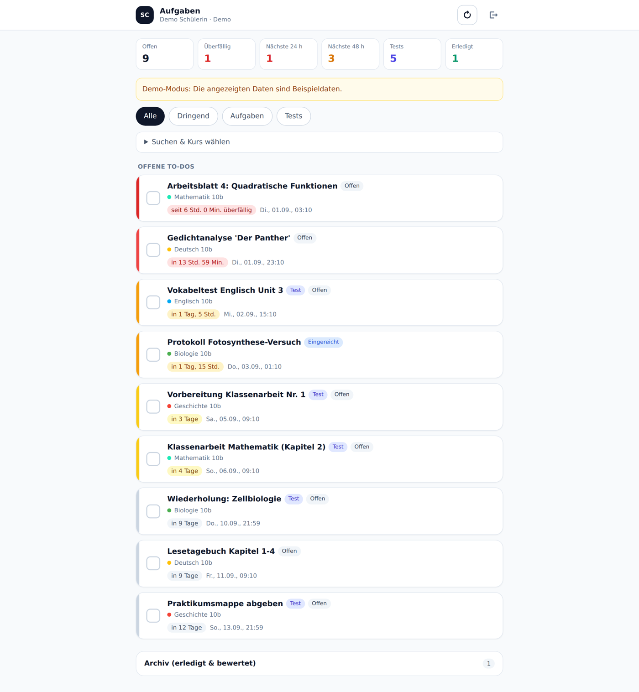
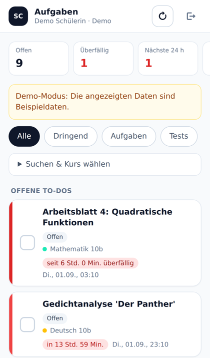

# Schul-Cloud Brandenburg – persönliches Dashboard

Ein Dashboard, das **auf deinem eigenen Rechner läuft** und Aufgaben, Abgabetermine
und Testankündigungen aus der Schul-Cloud Brandenburg einsammelt, nach Dringlichkeit
sortiert und eine eigene Abhak-Funktion mit Archiv bereitstellt.

Die Oberfläche ist fürs Handy gebaut: große Tippflächen, „Rückgängig" nach dem
Abhaken, Installation auf dem Homebildschirm und eine Liste, die auch ohne
Verbindung noch den letzten Stand zeigt. → [Abschnitt 1: Online stellen für die Handy-Nutzung](#1-ohne-eigenen-computer-online-stellen-für-handy-nutzung)

**Backend:** Python 3.9+ / Flask · **Frontend:** HTML + Tailwind CSS + Vanilla JS ·
**Speicher:** SQLite (nur lokal)



---

## 1. Ohne eigenen Computer: online stellen (für Handy-Nutzung)



Wer nur ein Handy hat, kann das Dashboard bei einem Hoster laufen lassen und es
danach jederzeit im Safari öffnen. Die Einrichtung geht komplett am Handy, dauert
etwa fünf Minuten und kostet nichts. Im Projekt liegt dafür ein fertiger Bauplan
(`render.yaml`).

1. **render.com** im Safari öffnen → **Get Started** → **Sign in with GitHub**
   (dasselbe GitHub-Konto, in dem dieses Projekt liegt).
2. Oben auf **New +** → **Blueprint**.
3. Das Repository **School-Management-** auswählen. Der Bauplan wird automatisch
   gefunden; er zeigt auf den Branch `claude/schulcloud-dashboard-y2fwoc`.
4. Render fragt nach **SC_DASHBOARD_PIN**. Das ist **keine vorgegebene Zahl** –
   du denkst dir hier selbst eine aus (4–6 Ziffern) und merkst sie dir. Sie ist ein
   zusätzliches Schloss vor der Seite. Das Feld darf auch leer bleiben; dann
   entfällt die Abfrage und es zählt nur die Anmeldung an der Schul-Cloud.
5. **Apply** drücken und zwei bis drei Minuten warten, bis „Live" erscheint.
6. Die angezeigte Adresse öffnen (etwa `https://schulcloud-dashboard-xxxx.onrender.com`):
   erst die PIN, dann die Schul-Cloud-Zugangsdaten eingeben.
7. In Safari unten auf **Teilen** → **Zum Home-Bildschirm**. Fertig – ab jetzt
   liegt „Aufgaben" als App auf dem Homebildschirm.

### PIN vergessen oder nie vergeben?

Kein Problem, sie lässt sich jederzeit überschreiben – die alte muss man dafür
nicht kennen:

1. In Render den Dienst **schulcloud-dashboard** öffnen.
2. Links auf **Environment**.
3. Bei **SC_DASHBOARD_PIN** auf den Wert tippen, die gewünschte Zahl eintragen
   und **Save changes** drücken. (Leer lassen schaltet die Abfrage ab.)
4. Render startet den Dienst neu; nach etwa einer Minute gilt die neue PIN.

Lokal steht derselbe Wert in der Datei `.env`.

**Was du dabei wissen solltest**

* Der Gratis-Plan legt den Server nach 15 Minuten ohne Zugriff schlafen. Der erste
  Aufruf danach dauert etwa eine Minute, danach ist es wieder flott.
* Die Anmeldung bleibt über solche Pausen hinweg bestehen: Das Sitzungs-Token liegt
  verschlüsselt im Cookie deines Handys, nicht auf dem Server. Läuft es ab, kommt
  einmal wieder die Anmeldemaske.
* Deine Haken speichert zusätzlich dein Handy selbst und meldet sie dem Server
  nach – der Gratis-Plan hat keinen dauerhaften Speicher.
* Render liefert die Seite über HTTPS aus. Das ist Pflicht, weil dein Passwort
  darüber läuft.
* Ehrlich benannt: Bei diesem Weg läuft der Server bei einem fremden Anbieter, und
  deine Schul-Cloud-Sitzung wird dort verarbeitet. Wer das nicht möchte, nimmt
  Abschnitt 2 (eigenes WLAN) oder betreibt das `Dockerfile` auf einem eigenen Gerät.

---

## 2. Alternative: im eigenen WLAN (mit Mac oder PC)

`http://127.0.0.1:5000` bedeutet immer „das Gerät, auf dem der Browser läuft". Der
Link funktioniert also nur, während das Programm auf genau diesem Gerät läuft – ein
Handy erreicht ihn nicht. Wer einen Rechner hat, kann ihn aber im WLAN freigeben:

1. In der `.env` eine PIN setzen: `SC_DASHBOARD_PIN=1234`
2. Starten mit `HOST=0.0.0.0 ./run.sh`
3. Das Terminal zeigt die WLAN-Adresse **und einen QR-Code**:
   ```
   → Auf diesem Rechner:  http://127.0.0.1:5000
   → Im gleichen WLAN:    http://192.168.2.31:5000

     Mit der Handy-Kamera scannen:
     ▄▄▄▄▄▄▄ ▄▄▄  ▄  ▄ ▄▄▄▄▄▄▄
     █ ▄▄▄ █ █ ▄▄▀█▄ ▄ █ ▄▄▄ █
     …
   ```
4. QR-Code mit der Handykamera scannen, PIN eingeben, anmelden. Auch hier lässt
   sich die Seite über **Teilen → Zum Home-Bildschirm** ablegen.

Das funktioniert nur, solange der Rechner läuft und beide Geräte im selben WLAN
sind; in Schul- oder Gäste-WLANs sind Geräte oft voneinander abgeschirmt.

**Auf dem Handy bedienbar** (bei beiden Wegen): große Tippfläche zum Abhaken mit
5 Sekunden „Rückgängig", waagerecht scrollbare Filter, automatische Aktualisierung
beim Zurückwechseln zur App und der zuletzt geladene Stand, wenn keine Verbindung
besteht.

---

## 3. Installation auf dem Mac (Schritt für Schritt)

1. **Terminal öffnen** – ⌘ + Leertaste, „Terminal" eingeben, Enter.
2. **Python prüfen:**
   ```bash
   python3 --version
   ```
   Kommt eine Versionsnummer (3.9 oder höher), ist alles gut. Kommt ein Fehler oder
   öffnet sich die Entwickler-Installation, Python von [python.org/downloads](https://www.python.org/downloads/)
   installieren und das Terminal danach neu öffnen.
3. **Projekt laden und starten:**
   ```bash
   git clone https://github.com/sawad4832-boop/School-Management-.git
   cd School-Management-
   ./run.sh
   ```
   `run.sh` legt beim ersten Mal eine virtuelle Umgebung an, installiert die
   Abhängigkeiten und startet den Server. Das dauert einmalig ein bis zwei Minuten.
4. Im Terminal erscheint:
   ```
   → Dashboard läuft auf http://127.0.0.1:5000
   ```
   **Jetzt** diesen Link in Safari öffnen. Das Terminal muss dabei offen bleiben –
   es *ist* der Server. Beenden mit `Ctrl + C`.
5. Auf der Login-Seite die Zugangsdaten der Schul-Cloud eingeben. Sie gehen direkt
   an `brandenburg.cloud` und werden nirgends gespeichert.

> **Erstmal ohne Zugangsdaten ausprobieren:** auf **„Demo-Daten ansehen"** klicken.
> Wenn das läuft, funktioniert die Installation – dann fehlt nur noch der Login.

Ohne `git` geht es auch: auf GitHub **Code → Download ZIP**, entpacken, im Terminal
in den Ordner wechseln (`cd ~/Downloads/School-Management--main`) und `./run.sh` starten.

### Wenn der Login nicht klappt: Verbindungstest

```bash
.venv/bin/python -m schulcloud.check
```

Der Test prüft die Erreichbarkeit, meldet sich an und zeigt die nächsten Termine.
Das Passwort wird verdeckt eingegeben und nicht gespeichert. Nur die Erreichbarkeit
prüfen: `.venv/bin/python -m schulcloud.check --no-login`.

Ausgabe im Erfolgsfall:

```
1) Erreichbarkeit von https://brandenburg.cloud
  ✅ Login-Seite erreichbar (HTTP 200)
2) Erwartete Endpunkte (401 = vorhanden, aber Login nötig)
  ✅ /api/v3/tasks: HTTP 401
3) Anmeldung
  ✅ Angemeldet als Mia Muster (Beispielschule)
  • verwendete Strategie: api
```

### Konfiguration (`.env`)

| Variable | Bedeutung | Standard |
|---|---|---|
| `SC_BASE_URL` | Adresse der Schul-Cloud-Instanz | `https://brandenburg.cloud` |
| `SC_API_URL` | optionale separate API-Adresse | – |
| `SECRET_KEY` | Signatur der Flask-Session | zufällig pro Start |
| `SC_REFRESH_MINUTES` | Hintergrund-Aktualisierung (0 = aus) | `15` |
| `SC_INGEST_TOKEN` | Token für die Browser-Erweiterung (leer = `/api/ingest` aus) | leer |
| `SC_DB_PATH` | Pfad der SQLite-Datei | `data/dashboard.sqlite3` |
| `SC_DASHBOARD_PIN` | PIN-Schutz des Dashboards (Pflicht bei `HOST=0.0.0.0`) | leer |
| `SC_PERSIST_SESSION` | Anmeldung übersteht Neustarts (Token verschlüsselt im Cookie) | `0` |
| `SC_SCAN_TOPICS` | Kursthemen nach Ankündigungen durchsuchen | `1` |
| `SC_DEMO` | Demo-Modus | `0` |
| `PORT` / `HOST` | Bindung des Servers | `5000` / `127.0.0.1` |

### Tests

```bash
.venv/bin/pip install pytest
.venv/bin/python -m pytest -q     # 55 Tests: Client, Parsing, Store, HTTP-API, PWA, Hosting
```

Dazu kommt ein Browsertest (`tests/test_e2e_restart.py`), der prüft, dass ein Haken
einen Serverneustart mit geleertem Speicher übersteht. Er wird übersprungen, solange
Playwright fehlt:

```bash
.venv/bin/pip install playwright && .venv/bin/playwright install chromium
```

---

## 4. Anmeldung an der Schul-Cloud

Es gibt **keine offizielle öffentliche API**. Die folgenden Endpunkte wurden gegen
`https://brandenburg.cloud` geprüft und werden vom Client verwendet:

| Endpunkt | Zweck |
|---|---|
| `POST /api/v3/authentication/local` | Login mit Nutzername/Passwort → JWT |
| `GET /api/v3/me` | angemeldeter Nutzer, Schule, Rollen |
| `GET /api/v3/tasks` | offene Aufgaben (Modul „Aufgaben") |
| `GET /api/v3/tasks/finished` | abgeschlossene und bewertete Aufgaben |
| `GET /api/v3/courses` | Kursübersicht inkl. Farbe |
| `GET /api/v3/news` | Ankündigungen (Quelle für Testtermine) |
| `GET /api/v3/course-rooms/<kurs>/board` | Themenübersicht eines Kurses |
| `GET /api/v3/boards/<id>` + `/api/v3/cards?ids=…` | Spalten-Boards mit Karten |
| `GET /courses/<kurs>/topics/<thema>` | Text eines klassischen Kursthemas (HTML) |
| `POST /login` | Formular-Login – benötigt das `_csrf`-Feld der Login-Seite |

Die älteren Feathers-Services (`/api/v1/homework`, `/submissions`, `/lessons`) sind auf
dieser Instanz **nicht** erreichbar und werden nur noch als Fallback für abweichende
Instanzen versucht; danach greift die HTML-Scraper-Logik.

**Login-Strategien** (in dieser Reihenfolge, die erste funktionierende gewinnt):

| Strategie | Ablauf |
|---|---|
| `api` | `POST /api/v3/authentication/local` → JWT → `Authorization: Bearer …` |
| `form` | `GET /login` (CSRF-Token lesen) → `POST /login` → `jwt`-Cookie |
| `cookie` | vorhandenes JWT übernehmen (Login-Feld „Session-Token" oder Erweiterung) |

Wird das Passwort abgelehnt (HTTP 401), bricht der Client sofort ab, statt es beim
Formular-Login ein zweites Mal zu versuchen – so laufen keine Fehlversuche auf.

**Bei Zwei-Faktor-Anmeldung oder Single-Sign-on** funktioniert der direkte Login nicht.
Dann in der Schul-Cloud im Browser anmelden, das Cookie `jwt` kopieren und im Dashboard
unter „Alternative: Session-Token" einfügen – oder die Browser-Erweiterung nutzen.

**Umgang mit Zugangsdaten**

* Das Passwort wird nur zum Login durchgereicht und **nie gespeichert**.
* JWT und Session liegen ausschließlich im Arbeitsspeicher des lokalen Servers
  (`SESSIONS` in `app.py`) – nach einem Neustart ist eine neue Anmeldung nötig.
* In SQLite landen nur Aufgaben-Metadaten und der eigene Abhak-Status. Ohne
  angemeldete Sitzung geben die Endpunkte davon nichts heraus – auf einer
  öffentlich erreichbaren Adresse ist die Aufgabenliste also nicht ohne
  Anmeldung lesbar.
* Der Server bindet standardmäßig auf `127.0.0.1` und ist nicht von außen erreichbar.

### Aktualisierung

* **Button „Aktualisieren"** in der Kopfzeile (`POST /api/refresh`).
* **Automatisch** alle `SC_REFRESH_MINUTES` Minuten – im Hintergrund-Thread des Servers
  und zusätzlich im geöffneten Browser-Tab.
* **Per Erweiterung** durch `POST /api/ingest`.

---

## 5. Browser-Erweiterung (Ordner `browser-extension/`)

Für den Fall, dass der direkte Login nicht möglich ist (2FA, SSO): Die Erweiterung liest
das Session-Cookie der bereits angemeldeten Schul-Cloud aus und schickt es an das lokale
Dashboard – oder scrapt die sichtbare Aufgabenliste direkt im Browser.

**Installation (Chrome/Edge):**

1. In der `.env` ein `SC_INGEST_TOKEN=<beliebiges-geheimnis>` setzen, Server neu starten.
2. `chrome://extensions` öffnen → **Entwicklermodus** → **Entpackte Erweiterung laden**
   → Ordner `browser-extension/` wählen.
3. Im Popup Dashboard-URL und Ingest-Token eintragen, **Einstellungen speichern**.
4. In der Schul-Cloud anmelden, dann **„Session & Daten übertragen"** klicken.
   Auf der Aufgabenseite funktioniert zusätzlich **„Sichtbare Aufgaben scrapen"**.

`/api/ingest` ist ohne gesetztes `SC_INGEST_TOKEN` deaktiviert und prüft den Header
`X-Ingest-Token` per `secrets.compare_digest`. (Safari verlangt für eigene Erweiterungen
ein Apple-Entwicklerkonto und Xcode – deshalb ist die Erweiterung für Chrome/Edge gebaut.)

---

## 6. Datenanalyse & Parsing

`schulcloud/parser.py` normalisiert alle Quellen auf ein einheitliches Format:

```json
{
  "id": "hw:5f2b…", "kind": "homework|exam", "title": "…", "course": "Mathematik 10b",
  "due": "2026-09-03T14:00:00+02:00", "status": "open|submitted|graded",
  "finished": false, "url": "https://…/homework/5f2b…", "teacher": "Herr Neumann"
}
```

* **Kursübersicht** – `/api/v3/courses`; liefert Name und Anzeigefarbe.
* **Aufgabenmodul** – `/api/v3/tasks` und `/api/v3/tasks/finished`: Titel, Fach,
  Beschreibung, Fälligkeit. Entwürfe von Lehrkräften werden übersprungen.
* **Abgabetermine** – `parse_datetime()` versteht ISO-8601, Millisekunden-Timestamps und
  deutsche Schreibweisen (`03.09.2026, 14:00`, `3.9.26`). Fehlt ein Termin, sucht
  `find_deadline_in_text()` Formulierungen wie „Abgabe bis 12.09.2026 um 18:00".
* **Status** – aus dem `status`-Objekt der Aufgabe: `graded > 0` → **bewertet**,
  `submitted > 0` → **eingereicht**, sonst **offen**. Bewertete und in der Schul-Cloud
  abgeschlossene Aufgaben landen automatisch im Archiv.
* **Testankündigungen** – Titel, Beschreibungen, Ankündigungen (`/api/v3/news`),
  Kalendereinträge und Kursthemen werden gegen eine Stichwortliste geprüft:
  Klassenarbeit, Klausur, Lernkontrolle, Vokabeltest, Prüfung, Diktat, Referat,
  Präsentation … Treffer erscheinen als Typ **„Test / Arbeit"**; gewöhnliche
  Stundenplan- und Schultermine werden bewusst ignoriert.
* **Kursthemen** – Lehrkräfte stellen Hausaufgaben und Tests oft nicht als
  offizielle Aufgabe ein, sondern schreiben sie in ein Kursthema. Beide dort
  vorkommenden Formen werden gelesen: klassische Themen (Titel über
  `/api/v3/course-rooms/<kurs>/board`, Text über die Seite
  `/courses/<kurs>/topics/<thema>`) und Spalten-Boards (`/api/v3/boards/<id>`
  plus `/api/v3/cards?ids=…`). Solche Einträge tragen in der Liste das Kennzeichen
  **„Kursthema"**.

  Damit nicht jedes Thema in der Liste landet, gilt eine zweistufige Regel:
  eindeutige Wörter (Hausaufgabe, Abgabe, Klassenarbeit, Test …) genügen allein,
  schwache (bearbeiten, lernen, Seite, mitbringen …) nur zusammen mit einem
  gefundenen Datum. Reine Materialsammlungen bleiben so draußen. Steht dieselbe
  Sache schon als offizielle Aufgabe, wird das Thema nicht doppelt gezeigt.

  Der Durchlauf kostet zusätzliche Abrufe und ist deshalb gedeckelt (höchstens
  12 Kurse und 45 Abrufe) sowie 30 Minuten zwischengespeichert. Abschalten mit
  `SC_SCAN_TOPICS=0`.

## 7. Übersicht & Interaktivität

* **Sortierung nach Dringlichkeit:** überfällig → < 24 h → < 48 h → diese Woche → später →
  ohne Termin, innerhalb einer Stufe nach Abgabezeitpunkt.
* **Farbliche Warnungen:** roter Balken bei überfällig und < 24 h, orange bei < 48 h,
  gelb innerhalb einer Woche, grau danach. Dazu ein Countdown („in 13 Std. 59 Min.").
* **Abhaken:** Klick auf die Checkbox → Eintrag wandert ins Archiv, dort per
  „Zurückholen" reversibel. Die Schul-Cloud erlaubt kein Setzen von außen, der
  Status wird deshalb selbst geführt – und zwar **doppelt**: im Browser
  (`localStorage`) und auf dem Server (SQLite). Beim Anzeigen gewinnt immer die
  Kopie des Geräts; fehlt dem Server ein Haken, wird er ihm nachgereicht. So
  überleben Haken auch das Leeren des Serverspeichers, wie es bei kostenlosen
  Hosting-Angeboten bei jedem Neustart passiert.
* **Abgegeben heißt erledigt:** Aufgaben, die die Schul-Cloud als eingereicht
  oder bewertet meldet, wandern von selbst ins Archiv und stehen nicht mehr
  unter „offen".
* **Kennzahlen:** offen, überfällig, nächste 24 h / 48 h, Tests, erledigt.
* **Filter** nach Typ (Aufgaben / Tests / dringend), Kurs und Volltextsuche.

### HTTP-Endpunkte des Dashboards

| Methode & Pfad | Zweck |
|---|---|
| `GET /` | Oberfläche |
| `GET /api/status` | Login-Status, Nutzer, letzte Aktualisierung |
| `POST /api/login` | `{username,password}` \| `{jwt}` \| `{demo:true}` |
| `POST /api/logout` | Session verwerfen |
| `GET /api/items` | aktive Liste + Archiv + Kennzahlen |
| `POST /api/refresh` | Daten neu von der Schul-Cloud holen |
| `POST /api/items/<id>/done` | `{done:true\|false}` – abhaken / zurückholen |
| `POST /api/items/state/bulk` | Abhak-Stand des Browsers nachmelden |
| `POST /api/items/<id>/note` | eigene Notiz speichern |
| `POST /api/pin` | PIN prüfen (nur bei gesetztem `SC_DASHBOARD_PIN`) |
| `POST /api/ingest` | Endpunkt der Browser-Erweiterung (Token nötig) |
| `GET /api/health` | Health-Check |

---

## 8. Projektstruktur

```
app.py                    Flask-App: Routen, Sessions, Hintergrund-Aktualisierung
schulcloud/client.py      Login-Wrapper (API / Formular+CSRF / Cookie) + Scraper-Fallback
schulcloud/parser.py      Normalisierung, Terminerkennung, Testerkennung, Dringlichkeit
schulcloud/store.py       SQLite: Abhak-Status, Notizen, Cache
schulcloud/check.py       Verbindungstest für die Kommandozeile
schulcloud/demo.py        Beispieldaten für den Demo-Modus
templates/index.html      Oberfläche (Tailwind)
static/js/app.js          Frontend-Logik (Fetch + DOM)
schulcloud/netinfo.py     Zugriffsadressen + QR-Code fuer das Handy
static/sw.js              Service Worker (Offline-Huelle)
static/icons/             App-Symbole fuer den Homebildschirm
Dockerfile                fuer den Dauerbetrieb auf einem eigenen Server
render.yaml               Bauplan fuer die Einrichtung bei Render (vom Handy aus)
browser-extension/        Chrome-/Edge-Erweiterung (MV3) als Alternative zum Login
tests/                    pytest-Suite (55 Tests inkl. Browsertest)
```

### Ohne CDN betreiben

Die Seite lädt Tailwind über das CDN, ein lokaler Build wird aber automatisch bevorzugt
(`static/css/tailwind.css` liegt bereits bei). **Wer Template oder JavaScript ändert,
muss ihn neu bauen** – er enthält nur die Klassen, die beim Bauen im Quelltext standen:

```bash
npx tailwindcss -i static/css/input.css -o static/css/tailwind.css --minify
```

Der Server warnt beim Start, wenn der Build älter als die Oberfläche ist. Alternativ
`static/css/tailwind.css` löschen, dann wird wieder das CDN benutzt.

---

## 9. Hinweise

* Das Tool ist ein privates Hilfsmittel für den **eigenen** Account und liest nur Daten,
  die dieser Account ohnehin im Browser sieht.
* Ändert die Schul-Cloud ihre Endpunkte, brechen die Abfragen. Anpassungen betreffen
  dann fast immer nur `schulcloud/client.py`; `python -m schulcloud.check` zeigt sofort,
  welcher Endpunkt nicht mehr antwortet.
* Für den Dauerbetrieb hinter einem Reverse-Proxy unbedingt festen `SECRET_KEY`, HTTPS
  und einen zusätzlichen Zugriffsschutz vorsehen.
